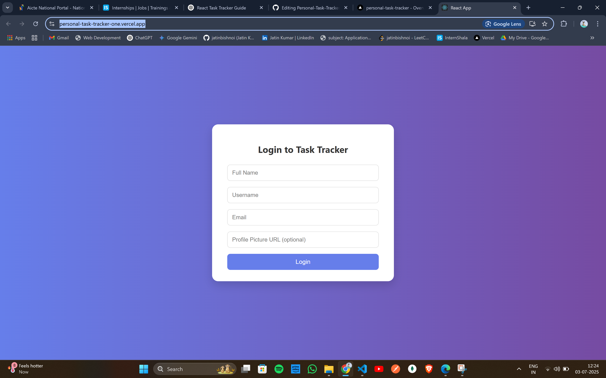
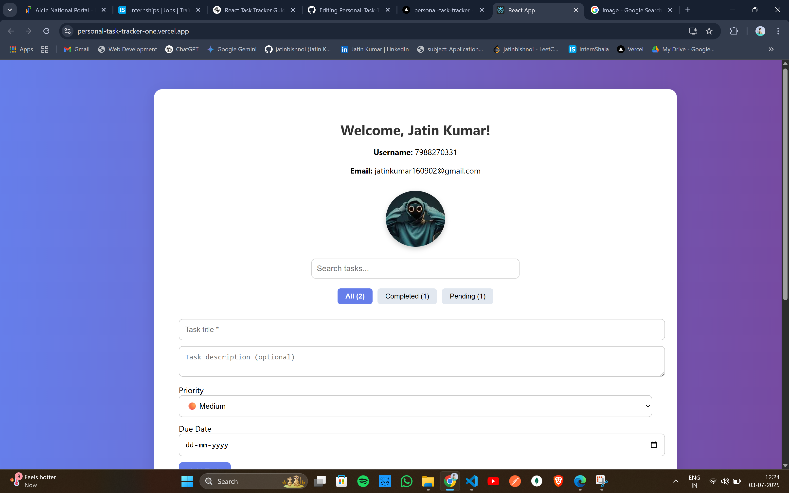
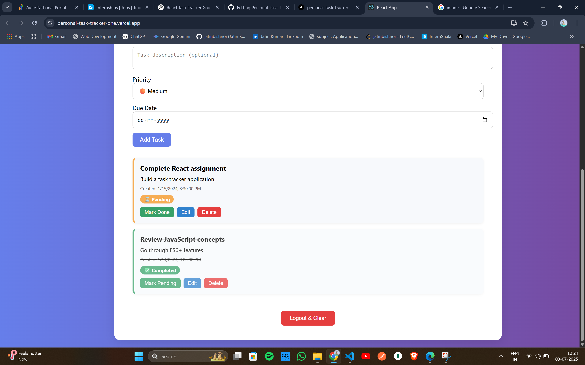

# 📋 Personal Task Tracker

A clean, responsive web app to help users manage their daily tasks efficiently. This task tracker allows you to create, edit, filter, search, and delete tasks—all in one place with a modern UI and persistent local storage.

---

## ✨ Features

- 📝 Add, edit, and delete tasks
- ✅ Mark tasks as completed or pending
- 🔍 Search tasks by title or description
- 📅 Set due dates
- 🔢 Task priority labels (Low, Medium, High)
- 🎯 Filter by task status (All, Completed, Pending)
- 🌙 Fully responsive design
- 💾 Tasks are saved in local storage (per user)

---

## ⚙️ Setup Instructions

1. Clone the repository  
   ```bash
   git clone https://github.com/your-username/personal-task-tracker.git
   cd personal-task-tracker
   ```

2. Install dependencies  
   ```bash
   npm install
   ```

3. Start the development server  
   ```bash
   npm start
   ```

4. Open the app in your browser:  
   [http://localhost:3000](http://localhost:3000)

---

## 🛠️ Technologies Used

- React.js (Hooks)
- CSS3 (Custom, fully responsive)
- Local Storage API
- Vercel (Deployment)

---

## 🌐 Live Demo

👉 [https://personal-task-tracker-one.vercel.app](https://personal-task-tracker-one.vercel.app)

---

## 📸 Screenshots

### 🔐 Login Page


### ✅ Task Management - 1


### ✅ Task Management - 2



---

## 💡 License

This project is for educational/demo purposes. Feel free to fork and customize!
